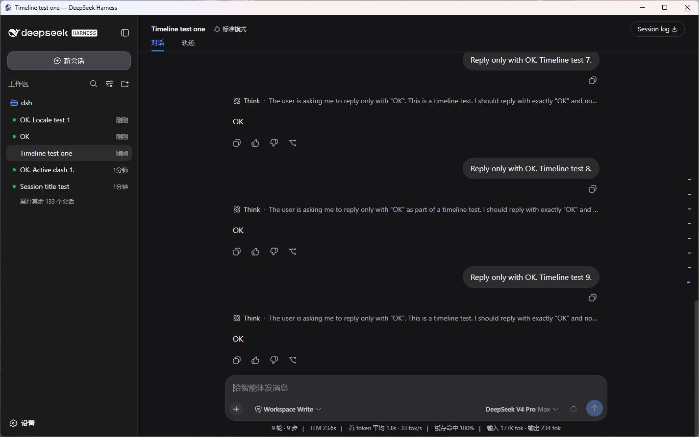
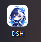

# dsh-desktop

给 DeepSeek Harness（DSH）加一个**桌面窗口**。装好之后桌面上会有一个「DSH 桌面版」图标，
双击就能用 DSH——不用开浏览器，不用记命令。

> 本页有两版说明：[给人看](#怎么安装给人看)（照着做就行）和 [给 AI Agent 看](#怎么安装给-ai-agent-看)（如果让 AI 帮你装）。

---

## 更新记录

### v0.1.2

- **桌面端内置「开发实例」按钮**：桌面窗口右下角多了一个悬浮按钮，可**一键启动 / 打开 / 停止**一个**独立端口（默认 `3081`）**的 dsh 实例。它和主服务（默认 `3080`）是**两个互不影响的服务**：
  - 更新桌面端 / 插件时**不用停掉开发实例**；反过来主用桌面端时，也能在开发实例里**测新功能、试新版本 dsh**，而不必关掉正在用的 dsh。
  - 配置项（`%APPDATA%\dsh-desktop\config.json`）：`devPort`（默认 `3081`）、`devHome`（默认空 = 共用主 home；填路径则隔离，**测新版本 dsh 时建议隔离**，避免新版的会话格式迁移影响主 home）。

### v0.1.1

- **`install` 自动下载 exe**：git / npm 渠道不再需要手动下载大 tgz；无内置 exe 时，`dsh-desktop install` 会自动从 GitHub 最新 Release 下载 `DSH-Desktop-*.exe`（私有仓库请设环境变量 `GITHUB_PERSONAL_ACCESS_TOKEN`）。
- **修复：安装版 CLI 无法启动**：桌面壳用 `cmd /c "<dsh.cmd>"` 拉起时，Windows 会把路径里的引号再转义成 `\"...\"`，导致报"不是内部或外部命令"。现已改为不预加引号。
- **修复：关窗后服务残留占用 3080**：关窗时只杀掉了 `cmd` 壳、留下真正的 node 服务变成孤儿进程。现改为关窗时杀掉整棵进程树，真正释放端口。
- **修复：不再自动弹出浏览器**：启动服务时加了 `--no-open`，桌面窗口本身就是界面。

---

## 预览

### 界面




## 图标



## 怎么安装（手动安装）

### 你需要先有

- Windows 10 或 11
- **`dsh` 命令能用**（终端里输入 `dsh` 能跑起来）。如果还没装，用 npm 全局安装即可：

  ```sh
  npm install -g @deepseek-ai/dsh
  ```

  装完在终端运行 `dsh --version`，能看到版本号就说明成功了（需要 Node.js ≥ 22，可先用 `node -v` 确认）。
- pnpm（DSH 能用的话，pnpm 一般已经装好了）

### 三步装好

**第 1 步**：到本仓库的 Release 页面，下载 `dsh-desktop-0.1.2.tgz` 文件。

**第 2 步**：打开终端（PowerShell），进入下载目录，执行：

```sh
dsh plugin --profile web add ./dsh-desktop-0.1.2.tgz
```

**第 3 步**：继续执行：

```sh
cd %DSH_HOME%\profiles\web
pnpm exec dsh-desktop install
```

看到「exe 已复制到 …」和「桌面快捷方式已创建」就成功了。

安装后，在 **设置 → 插件 → 插件列表** 中会显示为 **`desktop`**。

**你的桌面上现在有一个「DSH 桌面版」图标，双击就能用。**

### 双击之后会发生什么

- 如果 DSH 没在运行：自动帮你启动，几秒后打开窗口
- 如果 DSH 已经在运行：直接打开窗口，两边是同一个界面、同一份数据
- 关掉窗口：如果服务是它自己启动的，会一起关掉，不留后台进程

### 卸载

```sh
dsh plugin --profile web remove dsh-desktop
```

### 其他用法（可选，不用也行）

| 想做的事 | 怎么做 |
|---|---|
| 在 DSH 界面里直接开个桌面窗口 | 重启一次 DSH，然后在命令面板输入 `/desktop` |
| 从 GitHub 直接安装（不下载文件，但桌面图标功能会变成 Edge 窗口） | `dsh plugin --profile web add github:SuperPaiGu/dsh-desktop` |
| 从 npm 安装 | `dsh plugin --profile web add dsh-desktop` |

---

## 怎么安装（Agent 安装）

> 在用户机器上执行安装的确定性指令。按顺序执行，每步有验收条件。

### 0. 环境检测

```sh
node -v          # ≥ v22
pnpm -v          # 缺失则 npm install -g pnpm
dsh --version    # 命令不存在则提示用户先安装 DSH
```

### 1. 取得 tarball 并安装（首选渠道）

从 Release 下载 `dsh-desktop-0.1.2.tgz` 到工作目录，然后：

```sh
dsh plugin --profile web add ./dsh-desktop-0.1.2.tgz
```

**验收**：退出码 0，输出含 `+ dsh-desktop`。

（无 tarball 时备用：`dsh plugin --profile web add github:SuperPaiGu/dsh-desktop`，但该渠道不含桌面 exe。）

### 2. 验证组合层

```sh
dsh --profile web --dump-config
```

**验收**：输出含 `# == dsh-desktop` 段与 `name: dsh-desktop` 行。

### 3. 安装桌面 exe（tarball 渠道）

```sh
cd "$DSH_HOME/profiles/web"   # Windows: %DSH_HOME%\profiles\web；DSH_HOME 默认 ~/.dsh
pnpm exec dsh-desktop install
```

**验收**：输出「exe 已复制到 …」与「桌面快捷方式已创建」；目标目录出现 `DSH-Desktop-*.exe`。

### 4. （若要 Web UI 的 /desktop 命令）重启 dsh web

停止当前 dsh web 进程，以用户原有方式重新启动。

**验收**：启动日志出现 `[dsh-desktop] /desktop command registered`。

### 5. 验收清单

- [ ] 第 1 步退出码 0
- [ ] `--dump-config` 含 dsh-desktop 层
- [ ]（tarball）桌面出现「DSH 桌面版」图标
- [ ]（重启后）设置 → 插件 → 插件列表 中 desktop 行 active

### 6. 常见错误处理

| 现象 | 处理 |
|---|---|
| `dsh: pnpm failed in profile directory ... different major version of pnpm` | 在 profile 目录执行 `pnpm install --config.confirm-modules-purge=false` 后重试第 1 步 |
| `/desktop` 后无窗口 | 确认服务在 3080（或配置端口）运行；git 渠道无 exe，走 Edge 窗口 |
| 双击桌面 exe 停在「无法连接 DSH 服务」 | 设置环境变量 `DSH_BIN` 指向 dsh CLI，或先手动启动 dsh web 再双击 |
| 端口被占用 | 改 `%APPDATA%\dsh-desktop\config.json` 的 `port`，或关闭占用者 |

### 7. 环境变量参考

- `DSH_HOME`：dsh 主目录（默认 `~/.dsh`）
- `DSH_BIN`：桌面 exe 拉起服务用的 dsh CLI 路径（探测不到时才需要）
- `DSH_DESKTOP_REPO`：桌面 exe 自建服务用的 deepseek-harness 检出路径

---

## 从源码构建桌面 exe（给开发者，可选）

```sh
cd desktop
pnpm install     # 首次需联网（electron ~120MB）
pnpm run dist    # 产出 dist/DSH-Desktop-<版本>-x64.exe
```

注意：打包前关闭正在运行的桌面 exe；自定义图标放 `desktop/build/icon.ico`（没有则用默认图标）。

## 目录结构

```
dsh-desktop/            组合包根
├── package.json        dsh.bundle 声明
├── cordis.patch.yml    插件层（id desktop → dsh-desktop）
├── index.js            /desktop 命令（纯 JS，无构建步骤）
├── bin/                dsh-desktop 命令（run / install / help）
└── desktop/            Electron 桌面壳（探测→接入→自建→跟随退出）
```

## 已知限制

- 仅 Windows
- 独立双击 exe 的自建服务需要能找到 dsh CLI（按 检出 → DSH_BIN → 安装版 .bin/dsh → PATH 顺序探测）；找不到时先启动 dsh web 再双击
